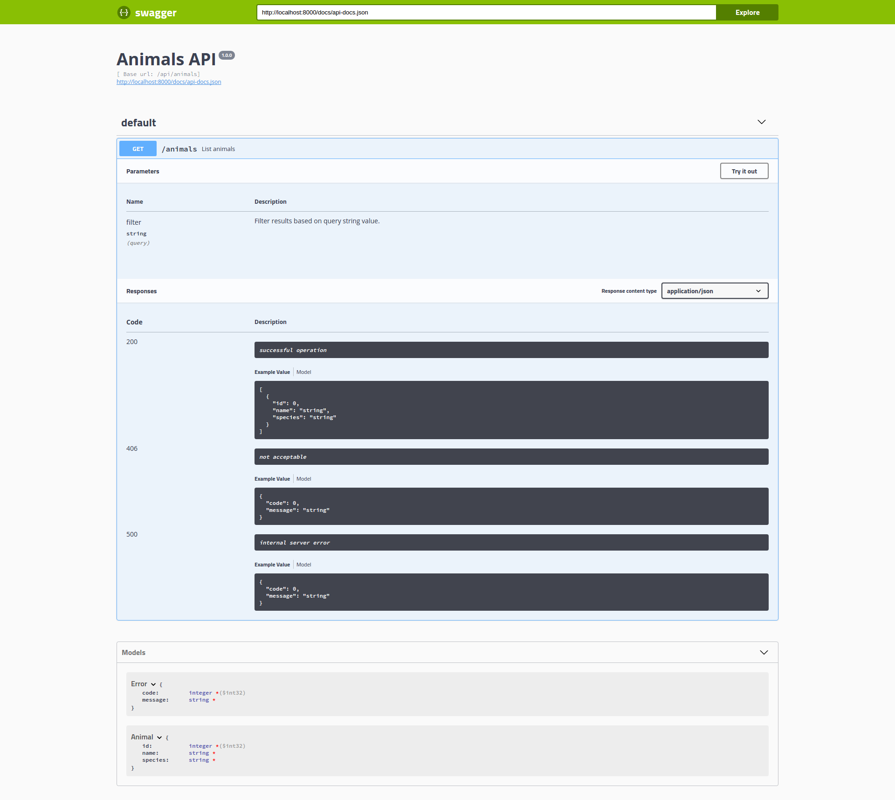

# Laravel and Swagger

Experimentation with a Laravel API and Swagger API documentation.

## Running it

You can run it following the commands below:

```bash
php artisan l5-swagger:generate

php artisan serve
```

After that, you can access [http://localhost:8000/api/docs](http://localhost:8000/api/docs).

You shold see something like this:


